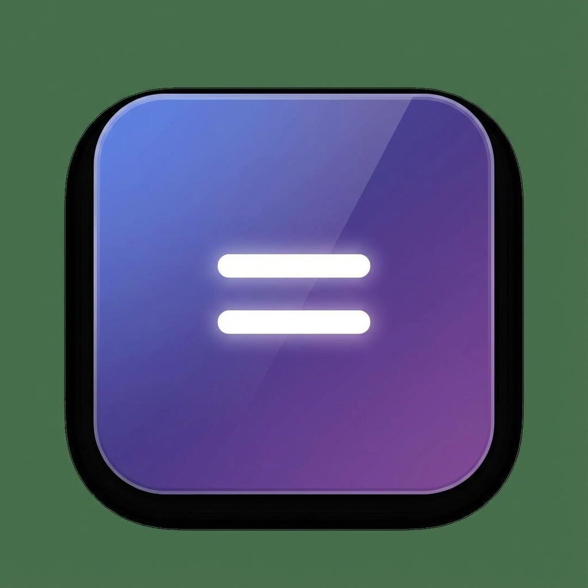

# 🧮 CalcuLTOR - Premium Calculator for Android

एक beautiful, modern calculator app जो Android पर चलती है with stunning graphical design.



## ✨ Features

- **Beautiful Dark/Light Theme** - Gorgeous glassmorphism design with animated background
- **Basic Calculator** - Addition, Subtraction, Multiplication, Division
- **Scientific Mode** - sin, cos, tan, log, ln, √, x², x³, factorial, π, e
- **Haptic Feedback** - Vibration on button press (Android)
- **Keyboard Support** - Use your keyboard for quick calculations
- **History** - See your previous calculations
- **Responsive Design** - Works perfectly on all screen sizes
- **Offline Support** - Works without internet

## 📱 APK Build Instructions

### Prerequisites

1. **Android Studio** installed on your computer
   - Download from: https://developer.android.com/studio

### Steps to Build APK

1. **Open Android Studio**

2. **Open the Project**
   ```
   File → Open → Select the "android" folder inside this project
   ```

3. **Wait for Gradle Sync**
   - Android Studio will automatically download dependencies
   - This may take 5-10 minutes on first run

4. **Build the APK**
   ```
   Build → Build Bundle(s) / APK(s) → Build APK(s)
   ```

5. **Find Your APK**
   ```
   android/app/build/outputs/apk/debug/app-debug.apk
   ```

6. **Install on Phone**
   - Transfer the APK to your Android phone
   - Enable "Install from Unknown Sources" in Settings
   - Install the APK

### Alternative: Build Signed APK (For Release)

1. **Generate Keystore** (one time only)
   ```
   Build → Generate Signed Bundle/APK → APK
   Create new keystore → Fill details
   ```

2. **Build Release APK**
   ```
   Build → Generate Signed Bundle/APK → APK
   Select keystore → Build
   ```

## 🛠️ Development Commands

```bash
# Install dependencies
npm install

# Add Android platform (already done)
npx cap add android

# Sync changes to Android
npx cap sync android

# Open in Android Studio
npx cap open android

# Update after making changes
npx cap copy android
```

## 📂 Project Structure

```
calculTOR/
├── android/          # Android native project (open this in Android Studio)
├── www/              # Web assets for Android
├── icons/            # App icons
├── index.html        # Main HTML file
├── styles.css        # Styling (dark/light themes)
├── script.js         # Calculator logic
├── manifest.json     # PWA manifest
├── sw.js            # Service worker
├── package.json     # NPM dependencies
└── capacitor.config.json  # Capacitor config
```

## 🎨 Design Features

- **Glassmorphism** - Modern frosted glass effect
- **Gradient Animations** - Beautiful floating orbs in background
- **Smooth Transitions** - Premium feel with micro-animations
- **Dark Mode** - Eye-friendly dark theme (default)
- **Light Mode** - Clean light theme option

## 👨‍💻 Made By

**TK** with ❤️

---

## Quick Start (Preview in Browser)

Before building APK, you can preview the calculator in browser:

1. Open `index.html` in your browser
2. Press F12 → Toggle device toolbar (mobile view)
3. Test all features

Enjoy your beautiful calculator! 🚀
